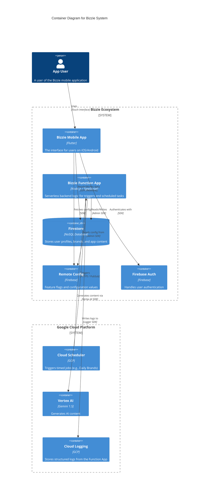
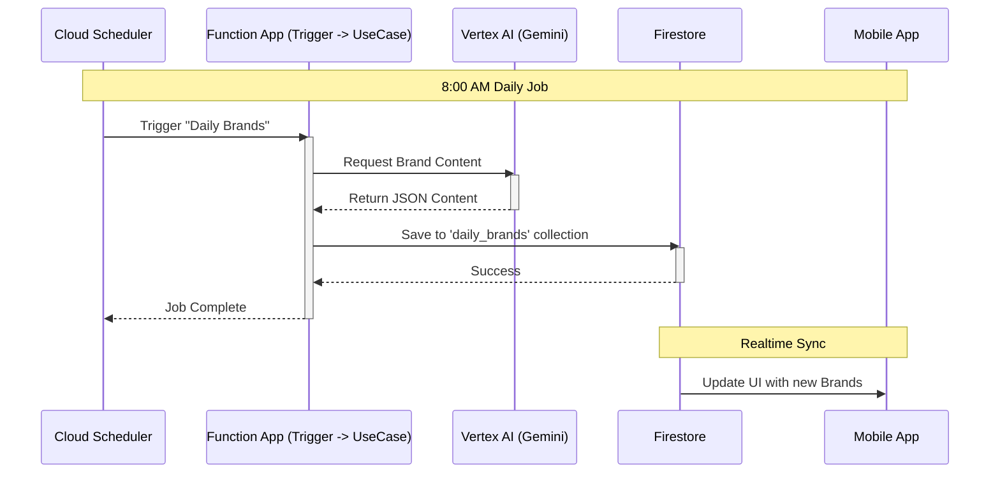

# Bizzie System Architecture - C4 Diagrams

## System Context & Containers

This diagram visualizes how the Bizzie Mobile App interacts with the Backend (Function App), Firebase, and Google Cloud services.

## Detailed Data Flow (Daily Brands Example)

## How to View These Diagrams

The code blocks above use **Mermaid.js**, a tool that turns text into diagrams. You have two ways to view them:

1.  **In Antigravity**:
    *   Open the **Command Palette** (`Cmd+Shift+P` on Mac, `Ctrl+Shift+P` on Windows).
    *   Type **"Markdown: Open Preview to the Side"** and select it.
    *   Alternatively, look for the **Open Preview to the Side** icon (a document with a magnifying glass) in the editor's top-right toolbar.

2.  **Online**:
    *   Go to the [Mermaid Live Editor](https://mermaid.live/).
    *   Copy the code inside the `mermaid` block (between the backticks).
    *   Paste it into the left side of the editor.
    *   You will see the visual diagram on the right. You can even download it as an Image (PNG/SVG).
