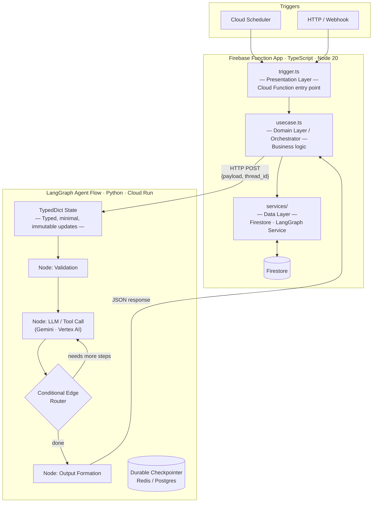

# LangGraph Architecture: Bizzie Strategy

LangGraph flows run in **Python** (Cloud Run or LangGraph Platform) and are called via **HTTP** from the Firebase Function App's `usecase.ts` layer. The function app stays TypeScript; LangGraph provides the agent intelligence layer.

## System Diagram

---

## Integration Contract

- **Caller**: `usecase.ts` (TypeScript) — HTTP POST to the LangGraph service.
- **Callee**: Python LangGraph service.
- **Payload**: `{ input: {...}, thread_id: string, config?: {...} }`.
- **Response**: `{ output: {...}, run_id: string, metadata?: {...} }`.
- **Idempotency**: `thread_id` must be scoped per feature run.
- **Timeout**: Cloud Function `timeoutSeconds` must exceed max graph execution time + 15s.

---

## Directory Structure

### TypeScript Feature Folder
`src/features/[feature_name]/`
- `trigger.ts`: Standard GCF entry point.
- `usecase.ts`: Orchestrator that calls the `LangGraphService`.
- `services/langgraph_service.ts`: HTTP client wrapping `src/core/retry.ts`.

### Python LangGraph Folder
`langgraph/[feature_name]/` (or standalone service)
- `graph.py`: StateGraph assembly and compilation.
- `nodes.py`: Node functions (async, partial updates).
- `state.py`: `TypedDict` for graph state.
- `config.py`: Environment-driven configuration.

---

## Non-Negotiable Rules

- LangGraph **always** runs in Python — no graph code in TypeScript.
- `usecase.ts` knows only the HTTP contract — never the graph's internal nodes or state.
- Durable checkpointing (Postgres/Redis) is mandatory for production.
- Every LangGraph feature requires a cost estimate before completion.
