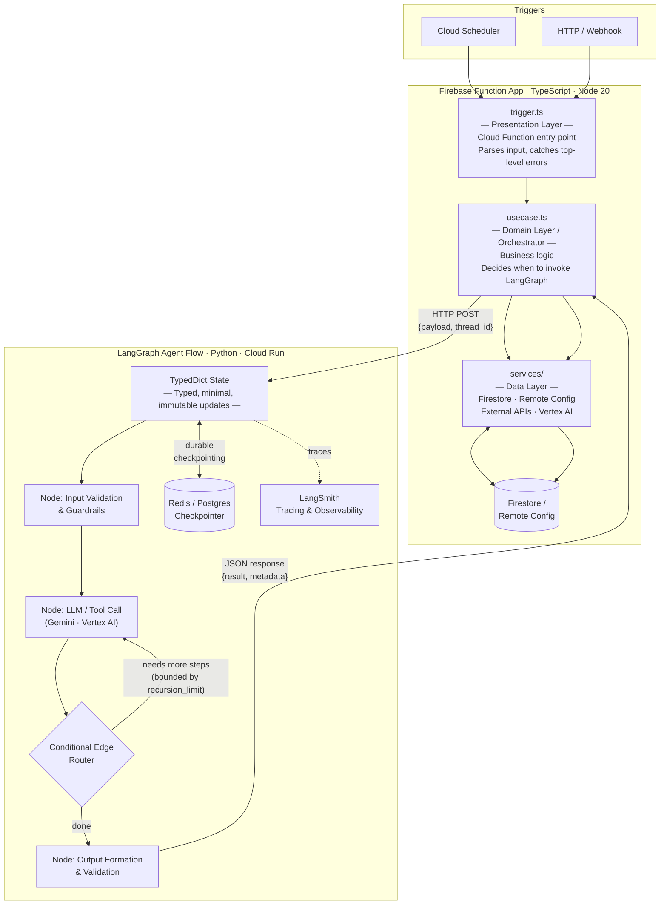
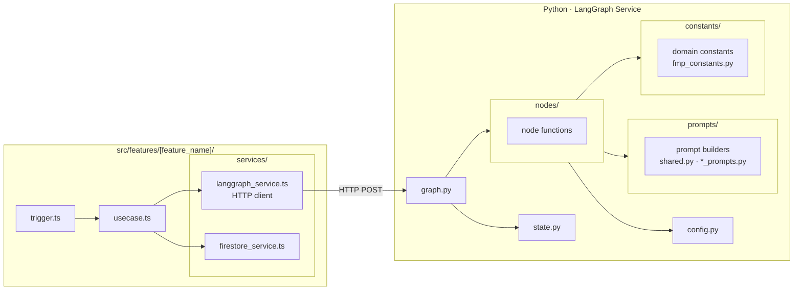

# LangGraph + Bizzie Function App — Architecture

Canonical reference for how LangGraph agent flows integrate with the Firebase Function App. Read this before implementing any LangGraph feature.

---

## Architecture Overview

LangGraph flows run in **Python** (Cloud Run or LangGraph Platform) and are called via **HTTP** from the Firebase Function App's `usecase.ts` layer. The function app stays TypeScript/Node 20; LangGraph provides the agent intelligence layer for features requiring multi-step reasoning, tool use, or stateful orchestration.

---

## Integration Contract

| Concern | Detail |
|---|---|
| **Caller** | `usecase.ts` (TypeScript) — HTTP POST to the LangGraph service |
| **Callee** | Python LangGraph service (Cloud Run or LangGraph Platform) |
| **Auth** | Service-to-service via GCP IAM ID tokens or Secret Manager shared secret |
| **Request payload** | `{ input: {...}, thread_id: string, config?: {...} }` |
| **Response payload** | `{ output: {...}, run_id: string, metadata?: {...} }` |
| **Idempotency** | `thread_id` scoped per feature run; durable checkpointer ensures safe retries |
| **Timeout** | Cloud Function `timeoutSeconds` must exceed max graph execution time + 15s buffer |

---

## Per-Feature File Structure

**Layer rules:**
- `trigger.ts` — unchanged; delegates to `usecase.ts` as always
- `usecase.ts` — calls `LangGraphService`, then passes result to downstream services (Firestore, etc.)
- `langgraph_service.ts` — thin HTTP client with retry (wraps `src/core/retry.ts`); URL from env/config; never hardcoded
- `langgraph/` directory — all graph logic lives here in Python; no graph code in TypeScript
- `nodes/` — async node functions only; no inline prompt strings, no domain constant sets
- `prompts/` — all LLM prompt strings and builders; `shared.py` holds cross-node utilities (`CONCISE_DIRECTIVE`, `PRICE_DISCLAIMER`, `_experience_instruction`, `_format_history`); one `*_prompts.py` per node that owns prompts
- `constants/` — domain configuration data (tool allowlists, denylists, thresholds); one `*_constants.py` per concern
- Every LangGraph implementation must satisfy `.claude/instructions/langgraph-enterprise-standards.md`

---

## Current Features & LangGraph Candidacy

| Feature | Current Implementation | LangGraph Potential |
|---|---|---|
| `sec_filing_analyzer` | Vertex AI direct call | **High** — multi-step: classify → extract → summarize → validate |
| `daily_brands` | AI generation + Remote Config | **Medium** — chain: prompt → generate → validate → publish |
| `watchlist_aggregator` | Data aggregation | **Medium** — map-reduce over watchlist items |
| `realtime_8k_notifier` | Real-time alert | **Medium** — classifier + router |
| `earnings_notifier` | Notification trigger | Low — simple chain |
| `bizzies_picks_notifier` | Notification | Low — simple chain |
| `subscription_drip` | Drip logic | Low — deterministic flow |

---

## Non-Negotiable Rules

- LangGraph **always** runs in Python — no `StateGraph` or graph code in TypeScript.
- `usecase.ts` knows only the HTTP contract — it never knows about nodes, state, or graph internals.
- `thread_id` must be scoped per feature run (e.g. `[feature]_[date]_[id]`) for idempotency.
- Cloud Function timeout must exceed max graph execution time + 15s.
- Every LangGraph feature requires a cost estimate (`.claude/docs/cost-estimates/`) and a review doc (`.claude/docs/reviews/`) before being considered complete.